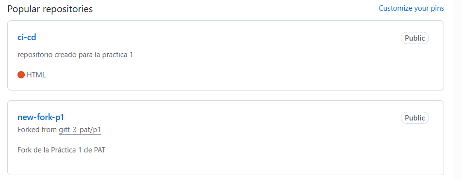

# Práctica 1

Un repositorio para empezar a usar [git](https://git-scm.com/) y Github


## ¿Como probar en la nube?

[Github-Codespaces](https://github.com/features/codespaces)

#### [Parte modificada por Martina]
# Git y GitHub
## Comandos git básicos

```
git clone https://github.com/gitt-3-pat/p1
git status
git add .
git commit -m "TU MENSAJE"
git push

git checkout -b feature/1
git checkout main
```

## Creación del fork

Se pide hacer un fork del repositorio: https://github.com/gitt-3-pat/p1; clicando en el enlace: https://github.com/gitt-3-pat/p1/fork

De esta manera, una vez realizado, tendremos dos repositorios en nuestra cuenta:




## Creación del Codespace

Se debe crear un Codespace propio para nuestro fork para trabajar en local. Esto permitirá aislar proyectos, tener una mayor seguridad y control de cambios y facilitar el borrado y creación de manera consistente.

#### [Parte añadida por Martina]
# Entorno de desarrollo Java

Instalar en el equipo:

- Java 17
- Maven
- Editor de código fuente (VsCode + IntelliJ)


## ¿Cómo escribir un README.md con formato?

[Github Markdown](https://docs.github.com/es/get-started/writing-on-github/getting-started-with-writing-and-formatting-on-github/basic-writing-and-formatting-syntax)

#### [Parte añadida por Martina]
## Documentación de la práctica:
En el repositorio 'new-fork-p1' encontraremos dos ficheros PDF:
- git.pdf : se explica cada comando git utilizado a lo largo de la práctica, mostrando a su vez su ejecución y logs en terminal.
- entorno.pdf : se muestran las descargas y versiones pedidas en el apartado 'Entorno de desarrollo Java'.